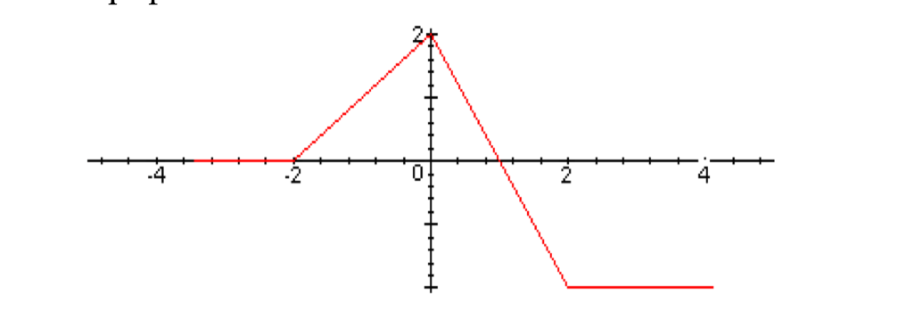
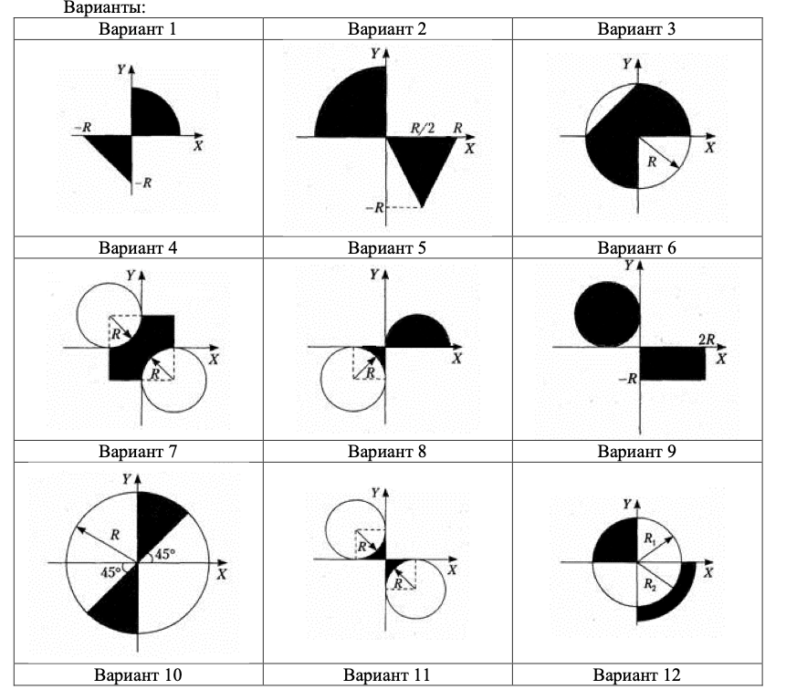
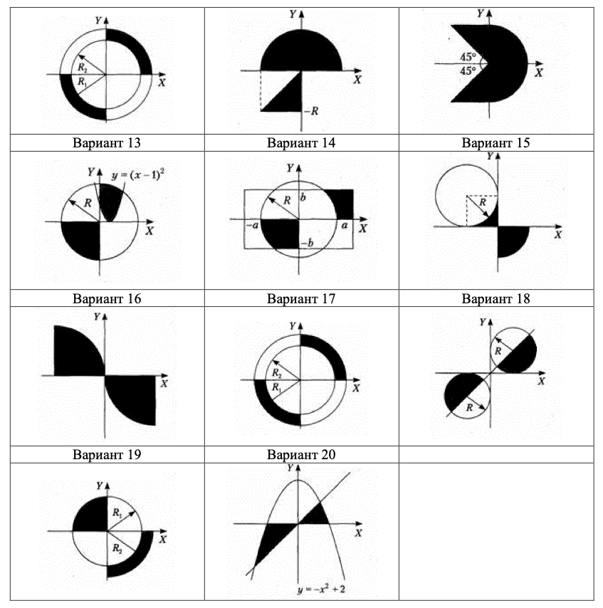

# ЛР2 ПМИ Разветвляющиеся алгоритмы

>[!IMPORTANT]
>За каждое задание можно получить не более одного балла. Для решения задач рекомен-
дуется использовать функции. В каждом задании необходимо написать и программный код.
Номер варианта можно узнать у преподавателя. Работы, выполненные по чужому вариан-
ту, не принимаются. Номер варианта остается постоянным для всех лабораторных работ.

1. Написать программу, которая по введенному значению аргумента вычисляет значение
   функции, заданной графически:
    
2. Написать программу, осуществляющую поиск максимального из трех введенных чисел.
3. Для введенного с клавиатуры 0<n<100, рассматриваемого как возраст человека, вывести
   фразу вида: «Мне 21 год», «Мне 18 лет», «Мне 34 года» (использовать оператор switch).
4. (3 балла) Дана заштрихованная область и точка с координатами (х, у). Написать про-
   грамму, определяющую, попадает ли точка в область. Результат вывести в виде тексто-
   вого сообщения.
   Схема выставления баллов:
    - Программа работает для всех допустимых пар точек — 1 балл.
    - Программа работает для всех допустимых пар точек, есть функция, решающая
    задачу — 2 балла.
    - Программа работает для всех допустимых пар точек, есть функция, решающая
       задачу, получающая все необходимые данные через параметры и возвращающая
       логическое значение (ввод и вывод в функции отсутствует) — 3 балла.

